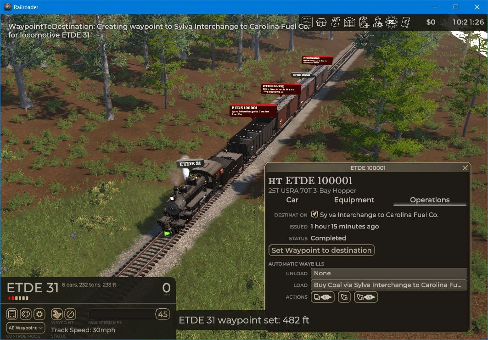

# Railroader Mod: WaypointToDestination

This mod adds a button to the freight car operations tab that will route the train to its destination track.

Caveats:
* This works with one locomotive and multiple units but there should only be one locomotive in the consist that _does not_ have it's brakes cut-out -- this is the locomotive the waypoint order will be given to.
* When there are multiple possible destination tracks, like at Sylvia Interchange, it doesn't know which is the best one to go to, it will just choose the first one it finds.
* It will route the train to whichever end of the destination track is furthest away. Usually this means the end of the track if the track is a dead-end. If there are cars in the way, then it will approach them but not couple.
* This only works with regular freight waybills, not repair or sell waybills.

## Installation

* Download `WaypointToDestination-VERSION.Railloader.zip` from the releases page
* Install with [Railloader](https://railroader.stelltis.ch/)
